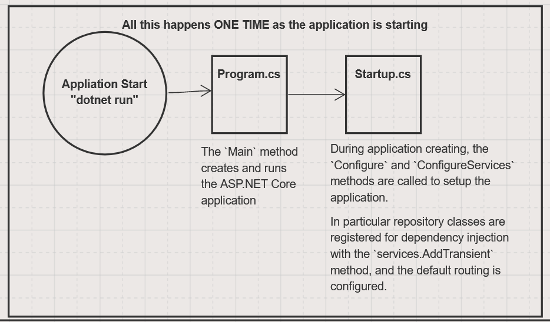
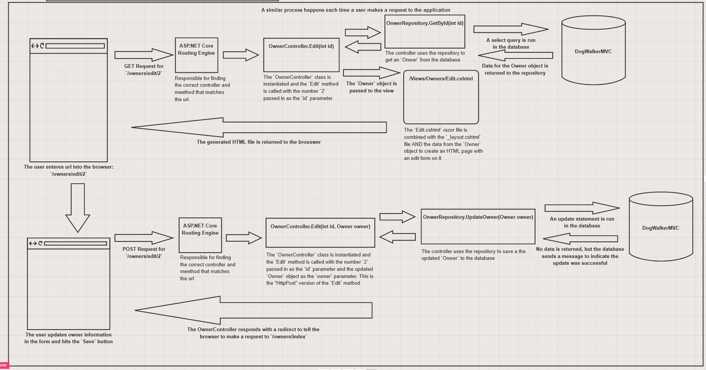

# MVC Q&A / Notes

## Dependency Injection

* What is a dependency?
  * A relationship between two "components"
    * one component cannot function without the other
    * one component is _dependent_ upon the other
    * Ex: Web app is dependent upon a sql server database
  * Dependencies in code
    * an object might be dependent upon another object
      * the first object MUST have the second object to do it's work
      * Ex: A `controller` is dependent upon a `repository`
        * `OwnersController` MUST HAVE an instance of the `OwnerRepository` in order to communicate with the database.
      * Dependencies are listed in the constructor of a class.
* dependency injection in ASP.NET Core
  * uses these methods to control the "lifetime" of dependencies
    * services.AddTransient
      * this instructs ASP.NET to create a NEW instance of the dependency each time the controller is instantiated
    * services.AddScoped
    * services.AddSingleton

### Control flow of MVC

  1. web browser requests a url: `/owners/details/1`
  1. ASP.NET receives the request and examines the url
  1. ASP.NET looks for a controller class that matches the first part of the url, `OwnersController`
  1. ASP.NET tries to instantiate the controller class to make a new object
  1. If the controller's constructor has parameters, ASP.NET weill create objects to pass into the constructor.
      - these are dependencies that the controller needs to do it's job
  1. Once the controller object is created, ASP.NET looks at the second part of the url, `details`, and tries to find a method with the same name.
  1. If it finds a method, ASP.NET invokes it.

### The MVC Process in Pictures

### Layout

* How can I make my MVC app look less boring?
  * Different layouts for different pages???
  * A "layout" is term for the boilerplate of the each web page. Contains headers and footers and any common element that each page would have
  * You can make custom layouts using `Layout = "somelayout";` in the individual razor file

 