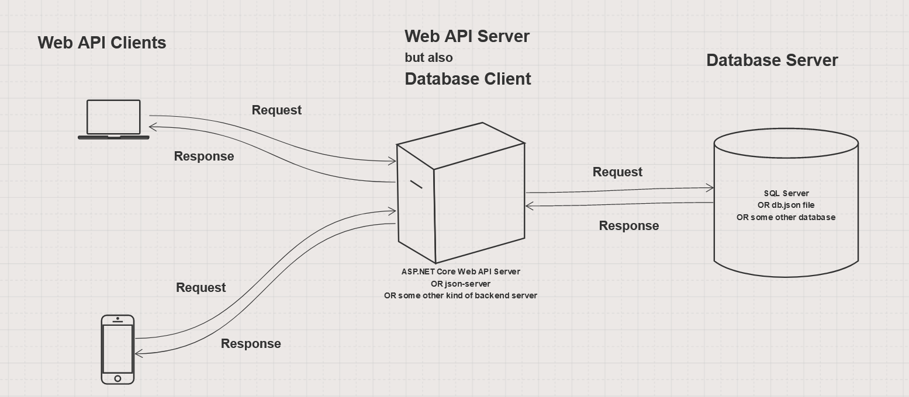

# ASP.NET Core Web API

## Clients and Servers

* Analogy
  * Coffee Shop
    * Customer is like a client
    * Barista is like a server
* Client
  * some software that makes requests
* Server
  * some software
  * fulfills a client's request
  * and returns a response
* common to have multiple clients and one server

## APIs

* API
  * Application Programming Interface
  * Software that is a bridge between other software components
    * The interface that some code can use to invoke some other code
  * As opposed to User Interface (UI)
    * A UI is the way a *human* interacts with some software
  * An API is like a UI in that it allows interaction with software
    * BUT an API allows _some other software_ to do the interacting
  * Examples of APIs
    * ADO.NET
    * fetch API in a browser
    * Web APIs
      * communicate vis HTTP and JSON

* ASP.NET Core Web API
  * The framework for building a Web API's in C#
  * Like "MVC" without the "V"
    * Still have models
    * Still have controllers
    * Still have repositories
    * Still have startup and appsettings.json
    * ...just no views
  * Controllers are a little different from MVC
  * Methods for each of the HTTP verbs
    * GET
      * may have more than one "get" method to return all data and/or individual records, etc...
    * POST
    * PUT
    * DELETE

